# 中山大学数据科学与计算机学院本科生实验报告

**（2019年秋季学期）**

**课程名称:** 区块链原理与技术              **任课教师:** 郑子彬

| 年级     | 2017级      | 专业（方向） | 软件工程                   |
| -------- | ----------- | ------------ | -------------------------- |
| 学号     | 17343155    | 姓名         | 张伟焜                     |
| 电话     | 15521147920 | Email        | zhangwk8@mail2.sysu.edu.cn |
| 开始日期 | 2019.11.09  | 完成日期     | 2019.12.13                 |

**项目地址：** https://github.com/WillKen/Supply-Chain 

## 一、  项目背景

**基于区块链的供应链金融平台**

本项目是基于区块链(FISCO-BCOS开源区块链系统)的供应链金融平台。实现了供应链上应收账款资产的溯源和流转。

具体来说，该平台将供应链上的每一笔交易和应收账款单据上链，同时引入第三方可信机构来确认这些信息的交易，例如银行，物流公司等，确保交易和单据的真实性。同时，支持应收账款的转让，融资，清算等，让核心企业的信用可以传递到供应链的下游企业，减小中小企业的融资难度。

**实现功能:** 

**功能一:** 实现采购商品—签发应收账款 交易上链。例如车企从轮胎公司购买一批轮胎并签订应收账款单据。

**功能二:** 实现应收账款的转让上链，轮胎公司从轮毂公司购买一笔轮毂，便将于车企的应收账款单据部分转让给轮毂公司。轮毂公司可以利用这个新的单据去融资或者要求车企到期时归还钱款。

**功能三:** 利用应收账款向银行融资上链，供应链上所有可以利用应收账款单据向银行申请融资。

**功能四:** 应收账款支付结算上链，应收账款单据到期时核心企业向下游企业支付相应的欠款。

**扩展功能1:企业加入供应链时的银行审计功能。** 为了获得银行的证明和信任，由银行将企业加入供应链中，即所有在供应链中的企业均会首先由银行进行审计，增强公司之间的信任度。只有银行能设定公司资产，在一定程度上杜绝了企业报假账的可能。

**扩展功能2: 账单到期后，下游企业能主动调用欠款清算。** 将清算操作权力交给下游企业，保证了一定的强制性，避免上游企业抵赖。

##  二、  方案设计

整个系统模型图如下。该系统采用了链端、后端+数据库、前端三层架构，其中链端有Webase作为接口，实现FISCO-BCOS链和后端的交互。

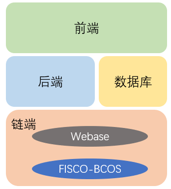

### 链端设计(合约设计)

- 设计两个枚举类型，分别表示公司类型（0-普通公司，1-银行）和账单状态（0-有效，1-无效）。

  ```
      enum Type{
          normal,
          bank
      }
      
      enum Status{
          valid,
          invalid
      }
  ```

- 首先，设计两证结构体。公司包括地址，名称和公司类型；账单包括欠款人名称，收款人名称，欠款人地址,收款人地址，账单金额，还款日期，账单状态。

  ```
      struct company{
          address companyAddress;
          string companyName;
          Type companyType ;
      }
      
      struct receipt{
          string fromName;
          string toName;
          address fromAddress;
          address toAddress;
          uint amount;
          uint endtime;
          Status receiptStatus;
      }
  ```

- 接着声明公共变量BANK记录合约部署者的地址（银行是部署合约的人）。三个映射，一个地址对应一个公司，对应一个账单数组，对应一个资产。

  ```
      address public BANK;
      
      mapping(address => company) public companys;
      mapping(address => receipt[]) public receipts;
      mapping(address => uint) public property;
  ```

- 合约部署时调用构造函数。设置银行名称和银行总资产。

  ```
      constructor (string bankName, uint balance) public{
          BANK=msg.sender;
          companys[msg.sender].companyAddress=msg.sender;
          companys[msg.sender].companyName=bankName;
          companys[msg.sender].companyType=Type.bank;
          property[msg.sender]=balance;
      }
  ```

- **（扩展功能）** 为了获得银行的证明和信任，由银行将企业加入供应链中，即所有在供应链中的企业均会首先由银行进行审计，增强公司之间的信任度。只有银行能设定公司资产，在一定程度上杜绝了企业报假账的可能。Require保证该函数智能由银行进行调用。

  ```
      function join (address cAddress, string cName, Type cType, uint p) public{
          require(companys[msg.sender].companyType==Type.bank,"Only the bank has rights to do this!");
          address node=cAddress;
          companys[node].companyAddress=cAddress;
          companys[node].companyName=cName;
          companys[node].companyType=cType;
          property[node]=p;
      }
  ```

- **（功能一）** 由函数调用者发起商品交易，输入参数（账单接收者地址、账单金额、还款期限（秒））。根据交易双方的参数，自动生成账单并加入到接收者的账单数组中。

  ```
      function GoodsTrade (address cAddress, uint money,uint second) public returns(bool){
          address up=msg.sender;
          address down=cAddress;
          receipts[down].push(receipt({
              fromName: companys[up].companyName,
              toName: companys[down].companyName,
              fromAddress: companys[up].companyAddress,
              toAddress: companys[down].companyAddress,
              amount: money,
              endtime: now+second,
              receiptStatus: Status.valid
          }));
          return true;
      }
  ```

- **（功能二）** 由函数调用者发起账单交易，输入参数（账单接收者地址、交易金额、现有账单对应的数组下标）。第一个require要求限制数组中，下表为rec的账单是存在的。第二个require要求被拆分的账单是有效的（暂时没有还款），第三个require要求交易金额要小于被拆分账单的金额。

  根据交易双方的参数，自动生成账单并加入到接收者的账单数组中，注意此时生成的账单的from是最开始欠款企业，这样便于最后进行欠款结算。最后对现有账单的金额进行更新。

  ```
      function ReceiptTrade (address cAddress, uint money, uint rec) public returns (bool){
          require(rec<receipts[msg.sender].length,"The receipt doesn't exist!");
          require(receipts[msg.sender][rec].receiptStatus==Status.valid,"The receipt is invalid!");
          require(receipts[msg.sender][rec].amount>=money,"Transaction amount is greater than bill amount!");
          address f=msg.sender;
          address t=cAddress;
          receipts[t].push(receipt({
              fromName: receipts[f][rec].fromName,
              toName: companys[t].companyName,
              fromAddress: receipts[f][rec].fromAddress,
              toAddress: companys[t].companyAddress,
              amount: money,
              endtime: receipts[f][rec].endtime,
              receiptStatus: Status.valid
          }));
          receipts[f][rec].amount=receipts[f][rec].amount-money;
          return true;
      }
  ```

- 转账函数。该函数是私有函数。三个参数分别是转出地址、转入地址、转账金额。Require转账金额小于等于转出账户的资产总额。

  ```
      function transfer(address fromAd, address toAd, uint amount) private{
          property[fromAd]=property[fromAd]-amount;
          property[toAd]=property[toAd]+amount;
      }
  ```

- **（功能三）** 函数调用者发起融资操作。首先，要满足函数调用者不是银行，接着需要满足要融资的账单是存在的，并且是有效的。

  首先将账单转移给银行（to 更改为BANK），然后调用者的账单状态变为失效。根据账单金额完成银行到调用者的转账操作。

  ```
      function Financing (uint rec) public{
          require(companys[msg.sender].companyType!=Type.bank);
          require(rec<receipts[msg.sender].length,"The receipt doesn't exist!");
          require(receipts[msg.sender][rec].receiptStatus==Status.valid,"The receipt is invalid!");
          receipts[BANK].push(receipt({
              fromName: receipts[msg.sender][rec].fromName,
              toName: companys[BANK].companyName,
              fromAddress: receipts[msg.sender][rec].fromAddress,
              toAddress: companys[BANK].companyAddress,
              amount: receipts[msg.sender][rec].amount,
              endtime: receipts[msg.sender][rec].endtime,
              receiptStatus: Status.valid
          }));
          receipts[msg.sender][rec].receiptStatus=Status.invalid;
          transfer(BANK,msg.sender,receipts[msg.sender][rec].amount);
      }
  ```

- **（功能四）** 由收款企业发起欠款清算。首先遍历该企业的所有账单，判断账单是否到期，再判断账单状态是否有效，并且收款人是自己。

  **（扩展功能2）** 若以上条件都满足，则调用转账函数，从欠款者向收款人进行转账。将清算操作权力交给下游企业，保证了一定的强制性，避免上游企业抵赖。

  ```
      function SettleAccount() public {
          for(uint i=0;i<receipts[msg.sender].length;i++){
              require(receipts[msg.sender][i].endtime<now);
              if(receipts[msg.sender][i].receiptStatus==Status.valid && receipts[msg.sender][i].toAddress==msg.sender){
                  transfer(receipts[msg.sender][i].fromAddress,msg.sender,receipts[msg.sender][i].amount);
                  receipts[msg.sender][i].receiptStatus=Status.invalid;
              }
          }
      }
  ```

### 后端设计

后端采用Go语言来实现，采用了gorilla/mux框架。

- 配置静态文件。配置静态文件，使得html文件能够调用css,js文件。

  ```go
  Router := mux.NewRouter()
  Router.PathPrefix("/css/").Handler(http.StripPrefix("/css/",http.FileServer(http.Dir("css"))))
  Router.PathPrefix("/js/").Handler(http.StripPrefix("/js/",http.FileServer(http.Dir("js"))))
  Router.PathPrefix("/imgs/").Handler(http.StripPrefix("/imgs/",http.FileServer(http.Dir("imgs"))))
  ```
 
 
- 配置路由，使用gorilla/mux框架。


  ```go
  	Router.HandleFunc("/information",getresults).Methods("POST") 
  	Router.HandleFunc("/transaction",transaction).Methods("POST")
  	Router.HandleFunc("/addAccount",addAccount).Methods("POST")
  	Router.HandleFunc("/getAddress",getAddress).Methods("POST")
  	Router.HandleFunc("/",Hello).Methods("GET")
  ```

- 设置路由端口，并启动监听。端口号为8080，根据上部路由配置，直接访问`localhost:8080`会调用`Hello`函数加载前端页面。

  ```go
  	server := http.Server{
  		Addr:":8080",
  		ReadTimeout:time.Second,
  		WriteTimeout:time.Second,
  		Handler:Router,
  	}
  
  	server.ListenAndServe()
  ```

- Hello函数。对于前端发来的GET请求，读取文件并返回页面(index.html)

  ```go
  func Hello(w http.ResponseWriter,r *http.Request){
  	w.Header().Set("Content-Type","text/html;charset=utf-8")
  	file,_:=ioutil.ReadFile("index.html")
  	fmt.Fprintln(w,string(file))
  	w.Header()
  }
  ```

- getresults函数。对于前端POST来的数据，调用Get函数(该函数会向链端发送http get请求，获得链端数据)，与链端进行交互。

  ```go
  func getresults(w http.ResponseWriter,r *http.Request)  {
  	//参数解析
  	body,_ := ioutil.ReadAll(r.Body)
  	fmt.Println(string(body))
  	var info string =Get(string(body))
  	fmt.Println(info)
  	w.Write([]byte(info))
  }
  ```

- transaction函数。对于前端发来的交易数据，该函数解析后调用Post方法与链端进行交互。 交互接口为`http://localhost:5002/WeBASE-Front/trans/handle`

  ```go
  func transaction(w http.ResponseWriter,r *http.Request)  {
  	//参数解析
  	w.Header().Set("Access-Control-Allow-Origin", "*")
  	body,_ := ioutil.ReadAll(r.Body)
  	fmt.Println(string(body))
  	var information string= Post("http://localhost:5002/WeBASE-Front/trans/handle",body,"application/json")
  	fmt.Println(information)
  	w.Write([]byte(information))
  }
  ```

- addAccount函数。前端发送创建账户的请求，根据官方文档，调用接口` http://localhost:5002/WeBASE-Front/privateKey?useAes={useAes}&type={type}&userName={userName} `。在调用前，涉及到对数据的处理，前端传入的json格式转换为字符串格式。获取链端数据后，返回json格式数据，便于前端进行处理。

  ```go
  func addAccount(w http.ResponseWriter,r *http.Request){
  	body,_ := ioutil.ReadAll(r.Body)
  	var params map[string]string
  	json.Unmarshal(body, &params)
  	fmt.Println(params["name"])
  	fmt.Println(params["assets"])
  	var info string =Get("http://localhost:5002/WeBASE-Front/privateKey?useAes=false&userName="+params["name"])
  	fmt.Println(info)
  	
  	var temp []byte = []byte(info)
  	var data map[string]string
  	json.Unmarshal(temp, &data)
  	//fmt.Println(data["publicKey"])
  	
  	table:="companyAddress"
  	key:=data["userName"]
  	value:=data["address"]
  	dbInsert(table,key,value)
  
  	res:="{\""+data["userName"]+"\":\""+data["address"]+"\"}"
  	fmt.Println(res)
  	w.Write([]byte(res))
  }
  ```

- getAddress函数。该函数是后端与数据库的一个接口函数。函数扫描数据库所有内容(公司名:账户地址)，然后将数据发送给客户端。

  ```go
  func getAddress(w http.ResponseWriter,r *http.Request){
  	// body,_ := ioutil.ReadAll(r.Body)
  	table:="companyAddress"
  	w.Write([]byte(scan(table)))
  }
  ```

- Post函数。与链端交互的接口，向接口发送交易数据，获取返回值传给父函数。涉及到了数据格式的处理与转换。

  ```go
  //向链段发送POST请求
  func Post(url string, data []byte, contentType string) string {
      req, err := http.NewRequest(`POST`, url, bytes.NewBuffer(data))
      req.Header.Add(`content-type`, contentType)
      if err != nil {
          panic(err)
      }
      defer req.Body.Close()
  
      client := &http.Client{Timeout: 5 * time.Second}
      resp, err := client.Do(req)
      if err != nil {
          panic(err)
      }
      defer resp.Body.Close()
  
      result, _ := ioutil.ReadAll(resp.Body)
      return string(result)
  }
  ```

- Get函数。与链端交互的接口，向接口发送请求数据，获取返回值传给父函数。

  ```go
  //向链段发送GET请求
  func Get(url string)string{
  	resp, err := http.Get(url)
      if err != nil {
          fmt.Println(err)
          return "error"
      }
      defer resp.Body.Close()
      body, err := ioutil.ReadAll(resp.Body)
  	return string(body)
  }
  ```

  

### 存储设计(数据库设计)

本项目采用boltdb数据库。该数据库与go语言有很好的兼容性，且操作简便。我们在数据库中存放了公司名和账户地址，能够有效减少后端访问链端次数，使得平台性能有明显提升。

- 向数据库中插入数据。首先，打开`zwk.db`，0600是操作权限。若数据库不存在，则会创建数据库。然后打开桶(表)，若不存在就创建桶(表)。接着对数据库对应桶(表)中的数据进行更新（插入数据）。最后关闭数据库。注：若不关闭数据库会导致文件锁一直锁住，会使程序错误，无法访问数据库。

  ```go
  // 数据库
  // 插入
  func dbInsert(table string,key string,value string){
  	db, err := bolt.Open("zwk.db", 0600, nil)
      if err != nil {
          log.Fatal(err)
  	}
  	db.Update(func(tx *bolt.Tx) error {	b,err:=tx.CreateBucketIfNotExists([]byte(table))
  		if err!=nil{
  			return  err
  		}
  		err = b.Put([]byte(key), []byte(value))
  		return err
  	})
  	defer db.Close()
  }
  ```

- 遍历数据库并取出数据。若数据库不存在，则会创建数据库。然后打开桶(表)，若不存在就创建桶(表)。按照格式向父函数返回（”name:address“）数据对。最后关闭数据库。

  ```go
  //遍历
  func scan(table string)string{
  	fmt.Println("scan_begin***********************")
  	db, err := bolt.Open("zwk.db", 0600, nil)
      if err != nil {
          log.Fatal(err)
  	}
  	var result string
  	db.View(func(tx *bolt.Tx) error {
  		// Assume bucket exists and has keys
  		b,err:=tx.CreateBucketIfNotExists([]byte(table))
  		if err!=nil{
  			return  err
  		}
  
  		c := b.Cursor()
  		result="{"
  		for k, v := c.First(); k != nil; k, v = c.Next() {
  			fmt.Printf("key=%s, value=%s\n", k, v)
  			result=result+"\""+string(k)+"\":\""+string(v)+"\","
  		}
  		result=strings.Trim(result,",")
  		result=result+"}"
  		return nil
  	})
  	defer db.Close()
  	fmt.Println("scan_end***********************")
  	return result
  }
  ```

### 前端设计

前端采用HTML，CSS，JS语言，并调用了jQuery库。没有采用前端框架。

HTML和CSS代码较为简单，不在此贴出。HTML中的大多标签都设置了class和id便于js文件通过选择器来触发响应函数。通过js函数(POST)，前端的数据发送给后端。之后，处理从后端取回的数据，将其显示在相应的页面位置。

这里重点展示JS代码，举例来说明前后端的交互。

以发送商品交易产生账单为例：

在”#goods_trade“按钮点击后，会触发该函数。首先针对trans数据进行添加。设置函数名称为”GoodsTrade“，交易发起者`user=$('#company_names option:selected').val();`读取下拉选项框中公司名对应的地址。设置交易的参数`trans.funcParam=[cAddress,value,time];`。注：合约地址在之前已经被其他函数设定好了。然后将数据发送给后端`localhost:8080/transaction`。得到返回数据data。将data写入日志，将文本框中数据清除。

```javascript
$("#goods_trade").click(function(){
	var cAddress=$("#address_goods").val();
	var value=$("#value_goods").val();
	var time=$("#time").val();
	user=$('#company_names option:selected').val();
	trans.funcName="GoodsTrade";
	trans.funcParam=[cAddress,value,time];
	trans.user=user;
	$.post("transaction",JSON.stringify(trans),
	function(data){
		$("#event").append("<p><strong>"+companyInfo[trans.user]+"</strong> ["+ $("#goods_trade").text()+"] "+data+"</p>");
		alert("Data: \n" + data);
		$("#address_goods").val("");
		$("#value_goods").val("");
		$("#time").val("");
	});
});
```

交易JSON数据初始化代码如下：

```javascript
var trans={
	"useAes": "false",
	"contractName": "Test2",
	"funcName": "",
	"funcParam": [],
	"user": "",
	"contractAddress": "",
	"groupId": 1
};
```

### 数据交互流程及接口设计

数据流图如下。基本为前端将数据发送给后端，后端将数据发送给链端；链端将数据传递给后端，后端将数据传递给前端进行显示。其中后端会将公司名称和地址存储在数据库中。

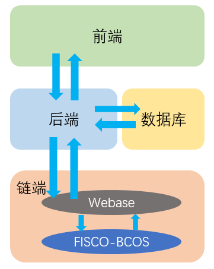

- 前、后端接口

  前后端的交互一般是鼠标点击按钮后，触发函数事件。将数据通过POST方法发送给后端，然后取回数据进行处理，显示在页面上。具体代码与函数见【前端设计】

- 后、链端接口

  在开发过程中，前后端都运行在Windows主机上，而链端部署在Linux虚拟机上。采用Vmware**虚拟机端口映射**，将虚拟机5000端口和5002端口映射到主机上，使得主机能够顺利访问webase和链端。接口展示如下，具体参数查看[官方文档]( https://webasedoc.readthedocs.io/zh_CN/latest/index.html )

  - 查询合约CNS接口：

    ` http://localhost:5002/WeBASE-Front/contract/cns?groupId={groupId}&name={name}&version={version}`

  - 获取公私钥接口：

    ` http://localhost:5002/WeBASE-Front/privateKey?useAes={useAes}&type={type}&userName={userName}`

  - 交易接口：

    ` http://localhost:5002/WeBASE-Front/trans/handle`

- 后端、数据库接口

  - dbInsert函数:具体代码与函数见【存储设计(数据库设计)】
  - scan函数:具体代码与函数见【存储设计(数据库设计)】

##  三、  功能测试

视频演示地址： https://github.com/WillKen/Supply-Chain/blob/master/demo.mp4 

### 1. 测试用例

在供应链中存在一个银行和ABC三个公司。

银行初始资产10000，A资产1000，BC资产为0

**扩展功能1：** 企业加入供应链时的银行审计

**功能一：** A向B发起商品交易，金额为1000。产生账单（from A to B 金额1000）。

**功能二：** B向C发起账单交易，金额为500。产生账单（from A to C 金额500），原来A to B账单金额变为500=1000-500。

**功能三：** 公司B用账单向银行融资，获得现金500，然后账单的状态变为无效，银行获得账单（from A to BANK 金额500）。

**功能四/扩展功能2:** 账单到期后，下游企业能主动调用欠款清算。还款时间到了，公司C和银行调用结算函数。发生转账操作（根据账单，从from地址 转向to地址 转账金额为账单金额）,转账完成，账单变为无效。

完成测试后，所有账单均变为无效，银行、公司A、B、C的资产，应该分别为10000，0，500，500。

### 2.测试过程及结果

1) 首先，配置链端环境。进行链的部署，银行私钥的建立以及合约部署。

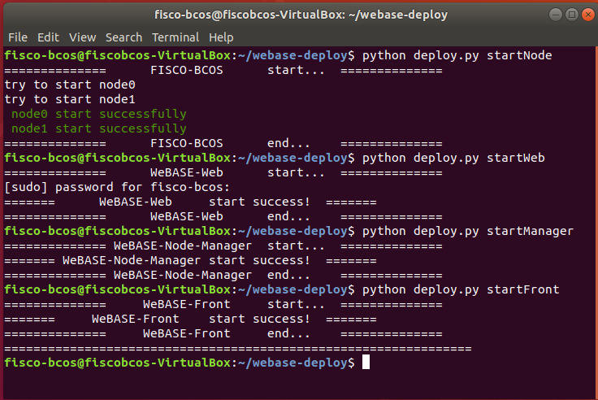

2) 开启客户端。进入源文件，打开命令行，执行 `go run main.go` 

3) 进入前端。在浏览器中输入`localhost:8080`，进入页面。首先弹出，检测到合约地址，接着弹出检测到银行地址。

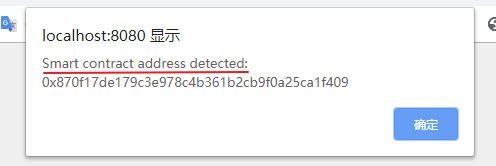

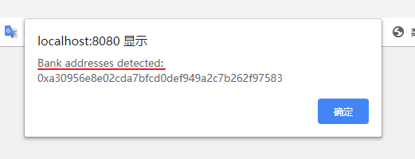

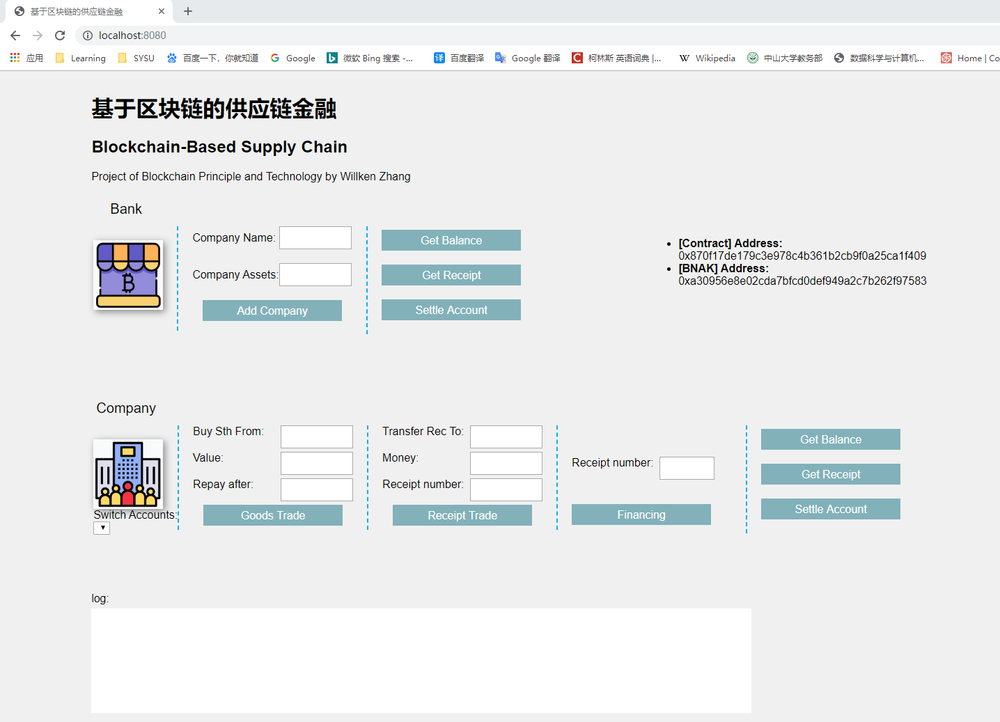

**4) 扩展功能1:** 银行审计企业加入。输入公司名称和审计得到的公司资产，将公司纳入供应链平台。这里依次加入公司A、B、C，资产分别为1000，0，0

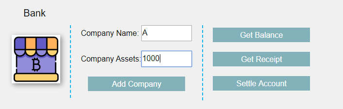

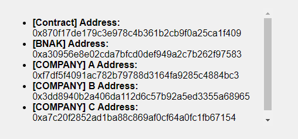

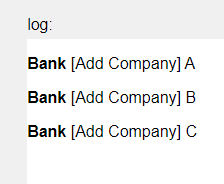

5) 注意，不同公司发起交易调用合约前先要进行账户切换：

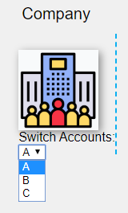

**6) 功能一:** 公司A向公司B发起商品交易。第一个参数为B公司地址，第二个参数为交易金额，第三个参数是seconds后还款。

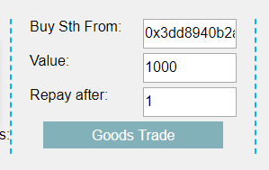

此时查看B的账单，显示如下。第一参数是欠款人姓名，第二参数是收款人姓名，第三参数是欠款人地址，第四参数是收款人地址，第五参数是账单金额，第六参数是还款时间，第七参数是账单是否有效（0为有效，1为无效）。

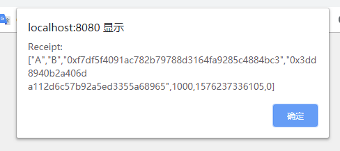

**7)功能二:** 公司B向公司C发起账单交易。第一个参数是C公司地址，第二个参数是交易金额，第三个参数是现有账单的下标。

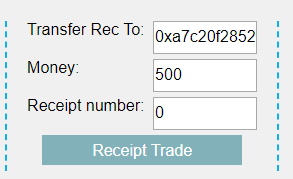

此时查看B、C账单，分别显示如下：

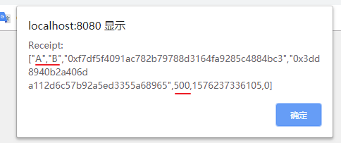

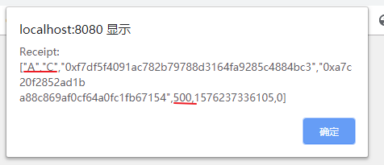

**8)功能三:** 公司B利用现有账单向银行融资。参数是账单数组的下标。

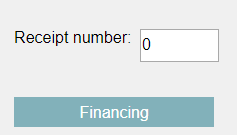

此时查看B和银行的资产，分别如下（500，9500）

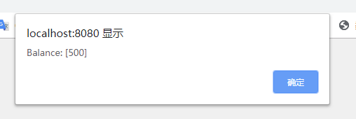

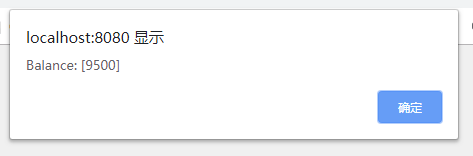

**9)功能四：扩展功能2:** 公司C清算账单。银行清算账单。

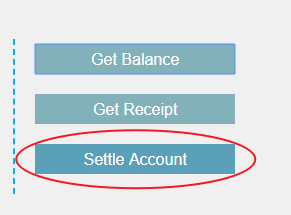

8) 最后查看银行、公司A、B、C的资产，应该分别为10000，0，500，500。结果如下，符合预期，说明我们的合约完成了上述几项功能。

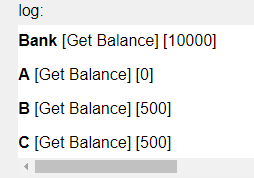


##  四、  界面展示

根据具体的功能，页面划分为**银行操作区**，**公司操作区**，**地址消息区**，**日志区**

**银行操作区**包含的功能有：添加银行，查询余额，查询账单，账单清算

**公司操作区**包含的功能有：商品交易(生成账单)，账单转移，申请银行融资，查询余额，查询账单，账单清算

**地址消息区**访问后端数据库，取回并显示：合约地址，银行地址，公司地址

**日志区**记录操作日志，便于查阅和审计

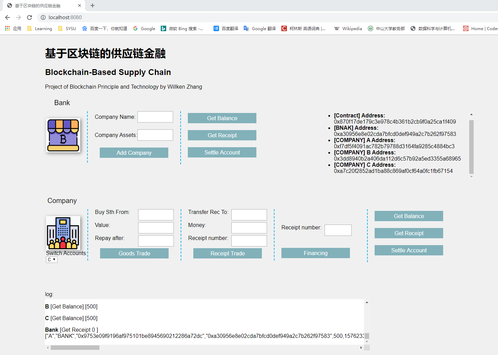

##  五、  心得体会

本次项目对综合能力要求很高。之前学习过前端，但是没尝试写过后端。这次项目让我第一次完成了全栈的开发。该项目涉及到的不仅仅是区块链的知识，更涉及到了页面设计，web变成，后端，数据库等知识，是对我们综合能力的一次考验。

刚开始面对大项目，我基本无从下手，但是TA们将大作业分为三个部分，使我们循序渐进完成任务。我认为这一点非常不错。在完成该项目的过程中，我体会到了阅读官方文档的重要性，许多技术性的难题都能在文档中找到答案。在做项目的过程中，我学习了许多新的知识。首先，我对区块链的认识更加深入了，对FISCO-BCOS联盟链有了实践上的掌握，对webase平台也有了一定的了解。之前没有接触过Go语言的我也用Go语言完成了后端开发。这让我认识到快速学习能力的重要性。此外，我还学习了gorilla/mux框架和boltdb数据库。综合下来，在短时间内学习了大量知识，这是对我综合能力的一种锻炼与提升。

在扩展功能方面，完成了两项功能扩展。一是企业加入供应链时的银行审计功能。为了获得银行的证明和信任，由银行将企业加入供应链中，即所有在供应链中的企业均会首先由银行进行审计，增强公司之间的信任度。只有银行能设定公司资产，在一定程度上杜绝了企业报假账的可能。扩展功能二是账单到期后，下游企业能主动调用欠款清算。将清算操作权力交给下游企业，保证了一定的强制性，避免上游企业抵赖。

当然，本次项目中也有做的不足的地方。比如前端还能更加美观，之后应该考虑学习前端框架，使得自己的界面更具美感。

最后，感谢微众银行的工程师们和TA们在群里的答疑，也感谢帮助过我的各位同学。

[项目传送门](https://github.com/WillKen/Supply-Chain) (https://github.com/WillKen/Supply-Chain )

